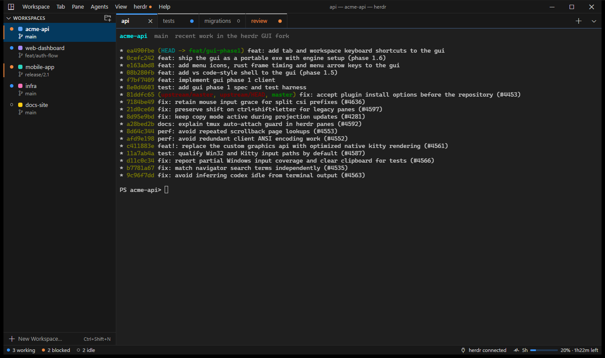
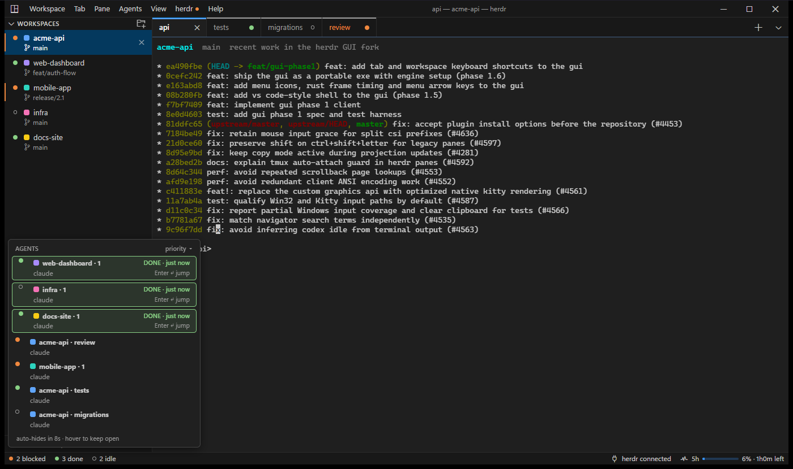
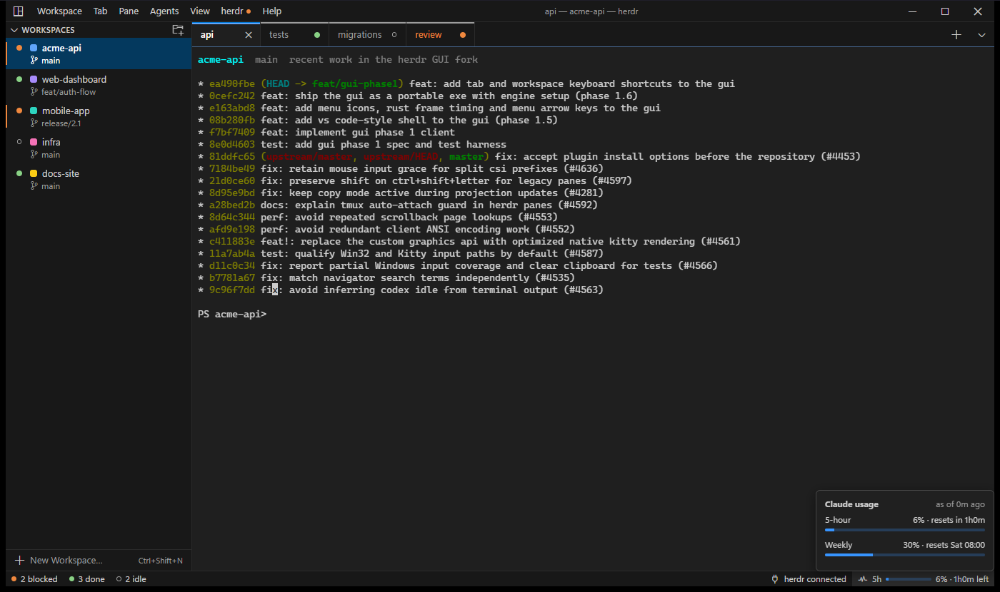
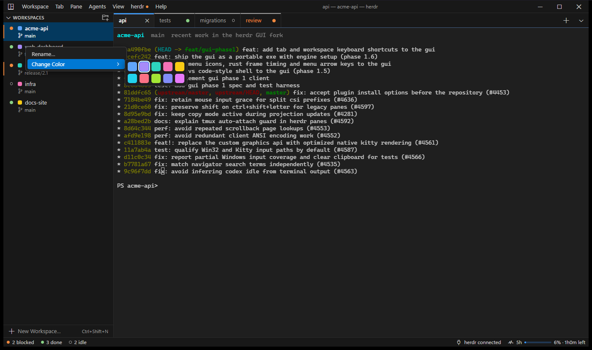
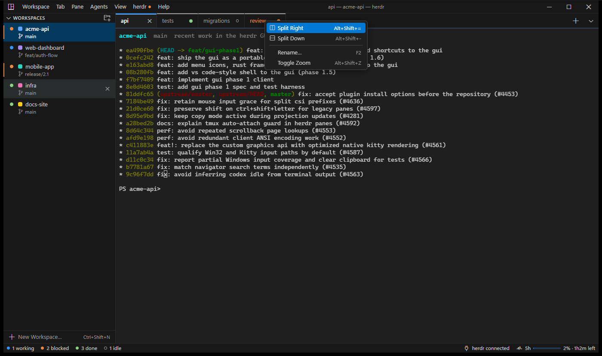
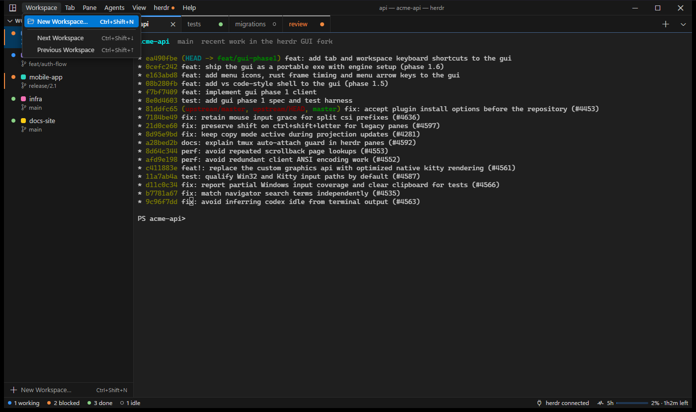
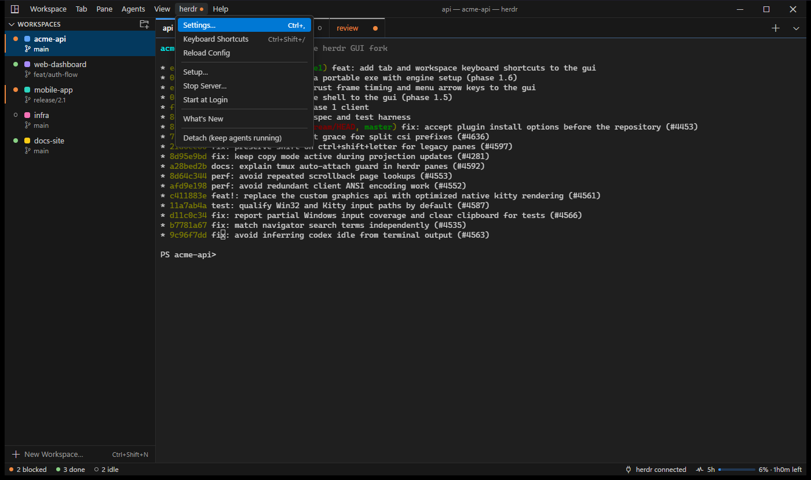
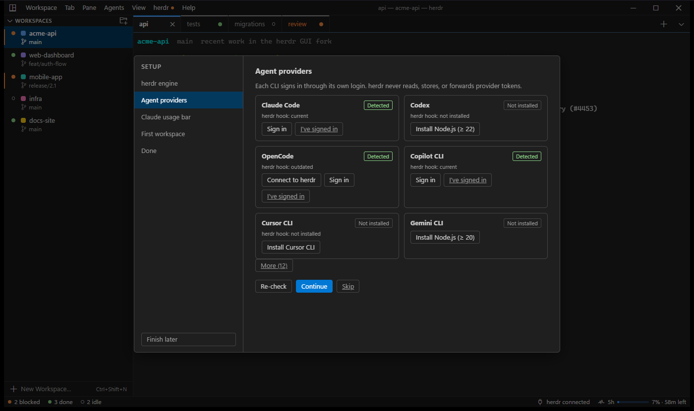
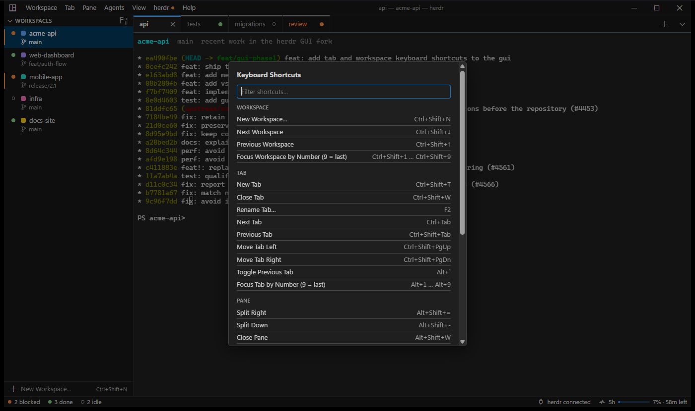

# Herdr Desktop

A Windows desktop app for running many coding agents side by side — Claude Code,
Codex, OpenCode, Copilot CLI, Cursor, Gemini and more — built on top of
[herdr](https://github.com/herdrdev/herdr), the terminal runtime for coding agents.

Herdr Desktop gives herdr a VS Code-style window: a workspace sidebar, editor-style
tabs, a crisp GPU-friendly terminal, and a status bar that tells you which agent
needs you next.



> Screenshots use a demo session (`acme-api`, `web-dashboard`, …); the terminal shows
> this repository's own commit history.

## Features

### See every agent at a glance

The status bar counts agents by state — working, blocked, done, idle. Blocked
workspaces get an orange bar in the sidebar, and each tab shows its agent's status
dot. When an agent finishes, the agent list opens with a **DONE · just now** card;
press Enter to jump straight to it. If the window is in the background you get a
Windows notification instead.



### Claude plan usage, always visible

The status bar shows your 5-hour Claude usage and time left. Hover it for the
weekly limit and reset times. The numbers come from Claude Code's own status line —
Herdr Desktop never reads or stores your Claude credentials.



### Workspaces with colours, tabs with splits

Each workspace (one per project folder) gets its own colour, shown on the sidebar
and on the selected tab. Right-click a workspace to rename it or change its colour.
Right-click a tab to split it right or down, rename it, or zoom a pane. Tabs can be
dragged to reorder and closed with their ×.

| Workspace colours | Tab menu |
|---|---|
|  |  |

### Menus for everything

A VS Code-style menu bar: **Workspace**, **Tab**, **Pane**, **Agents**, **View**,
**herdr** and **Help**. *Workspace ▸ New Workspace…* opens a folder picker and turns
the folder into a workspace. The **herdr** menu mirrors herdr's own menu: settings,
setup, start/stop the server, start at login, and what's new.

| Workspace menu | herdr menu |
|---|---|
|  |  |

### Guided provider setup

*herdr ▸ Setup…* checks the herdr engine, detects which agent CLIs are installed,
installs missing ones in a visible terminal tab (only after you confirm), connects
them to herdr for status detection, and signs you in with each CLI's own login.



### Keyboard first

Shortcuts only use Ctrl+Shift, Alt and a few function keys, so everyday keys like
Ctrl+C, Ctrl+R or Ctrl+T still reach Claude Code and your shell. Press
**Ctrl+Shift+/** for the searchable cheat sheet.



| Shortcut | Action |
|---|---|
| `Alt+1` … `Alt+9` | Go to tab 1–8 / last tab |
| `Ctrl+Shift+1` … `Ctrl+Shift+9` | Go to workspace 1–8 / last workspace |
| ``Alt+` `` | Toggle between the last two tabs |
| `Ctrl+Shift+T` / `Ctrl+Shift+W` | New tab / close tab |
| `Ctrl+Tab` / `Ctrl+Shift+Tab` | Next / previous tab |
| `Ctrl+Shift+N` | New workspace from a folder |
| `Ctrl+Shift+↓` / `Ctrl+Shift+↑` | Next / previous workspace |
| `Ctrl+Shift+E` | Focus the sidebar (arrows + Enter) |
| `Alt+Shift+=` / `Alt+Shift+-` | Split right / split down |
| `Ctrl+Shift+J` | Jump to the next agent that needs you |
| `Ctrl+Shift+A` | Show the agent list |
| `Ctrl+Shift+/` | Keyboard shortcuts |

### More

- **Themes** — Dark Modern by default, plus herdr, Catppuccin Mocha, Tokyo Night,
  One Dark Pro and Dracula. *View ▸ Import VS Code Theme…* loads any VS Code theme
  (`.json` or `.vsix`).
- **Fast terminal** — device-pixel rendering with a glyph cache; box-drawing
  characters join without gaps; `Ctrl+Shift+Alt+P` shows a performance overlay.
- **Light on memory** — about 180 MB when idle; WebView2 drops to low-memory mode
  while the window is minimized.
- **Agents keep running** — closing the window never stops your agents; the herdr
  server keeps them alive.

## Download and run

Herdr Desktop is a single portable `.exe` — no installer.

1. Download `Herdr Desktop.exe` from the
   [Releases](https://github.com/arifinreinaldo/mine-51-herdr-desktop/releases) page.
2. Run it. The build is not code-signed yet, so Windows SmartScreen may warn you:
   choose **More info → Run anyway**.
3. If herdr is not installed, the banner offers **Open Setup**. The herdr engine
   (0.9.1) is bundled inside the `.exe` and installs offline after a SHA-256 check.

Requirements: Windows 10 or 11 (64-bit) with the WebView2 runtime (built into
Windows 11).

## Build from source

Requirements: Rust 1.96.1 (see `rust-toolchain.toml`), Node.js 20+, npm.

```powershell
cd gui
npm install
npm run check      # format, clippy, Rust + Vitest tests
npm run package    # portable exe -> gui/target-agent/release/portable/
```

`npm run package` downloads the pinned herdr release package and verifies its
SHA-256 before embedding it. Specs and design notes live in [`gui/docs/`](gui/docs).

## How it works

Herdr Desktop is a client of a normal herdr server. It connects over herdr's
stable client protocol (generation 1), renders the server's terminal grid on a
canvas, and sends keyboard input back. Workspaces, tabs, panes and agent detection
all live in herdr, so the terminal UI and the desktop app can share the same
sessions.

```
gui/
  src/            TypeScript frontend (shell, sidebar, tabs, renderer, setup)
  src-tauri/      Rust backend (herdr connection, engine setup, settings)
  crates/herdr-wire/  herdr client protocol types
```

## Credits and license

Herdr Desktop is a fork of [herdr](https://github.com/herdrdev/herdr) by the herdr
authors, licensed under the [Apache License 2.0](LICENSE). The original herdr README
is kept in [`README.herdr.md`](README.herdr.md). Icons are
[Codicons](https://github.com/microsoft/vscode-codicons) © Microsoft (CC BY 4.0).

This project is not affiliated with or endorsed by the herdr maintainers.
